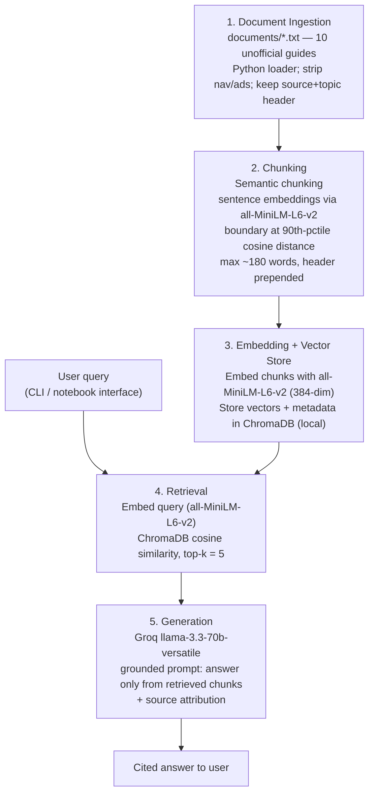

# Project 1 Planning: The Unofficial Guide

> Write this document before you write any pipeline code.
> Your spec and architecture diagram are what you'll use to direct AI tools (Claude, Copilot, etc.) to generate your implementation — the more specific they are, the more useful the generated code will be.
> Update the Retrieval Approach and Chunking Strategy sections if you change your approach during implementation.
> Update this file before starting any stretch features.

---

## Domain

**An unofficial freshman survival guide for the University of Texas at Austin** — the practical, lived-experience knowledge students pass to each other about housing, dining, studying, getting around, packing, and navigating campus.

This system makes student- and alumni-generated survival advice searchable and answerable: a user asks something like "Which dining hall is all-you-can-eat?" or "Where can I study late at night near campus?" and gets a grounded answer drawn from real student blogs, Her Campus articles, and unofficial guides. This knowledge is hard to find through official channels because the university's own pages (orientation.utexas.edu, housing.utexas.edu) tell you the *rules and logistics* but not the *insider tips* — that J2 is the buffet and Jester City Limits charges per dish, that the dorms are notoriously freezing, that Bennu Coffee is open 24 hours, or that a campus parking permit is jokingly called a "hunting license." That tacit knowledge lives only in what students write for each other, scattered across dozens of blogs, forum threads, and articles that you can't query in plain language.

<!-- What domain did you choose? Why is this knowledge valuable and hard to find through official channels? -->

---

## Documents

<!-- List your specific sources: URLs, subreddit names, forum threads, or file descriptions.
     Aim for at least 10 sources that together cover different subtopics or perspectives within your domain. -->

All sources are **unofficial** student/alumni guides (blogs, Her Campus, lifestyle sites) — deliberately *not* the university's own pages, since the goal is the "real" knowledge rather than the official kind. Sources were chosen to cover distinct subtopics (general survival, dorms, dining, study spots, transportation, admissions, orientation, packing) so the corpus answers a range of questions. Some topics are intentionally covered by two sources (study spots, packing) so retrieval can be tested on agreeing-vs-conflicting sources. Each document was cleaned of navigation, ads, and sidebars during ingestion; a source header (site + URL + topic) is kept at the top of every file for citation.

| # | Source | Topic | URL or location |
|---|--------|-------|-----------------|
| 1 | robinmorph (student blog) — "A Freshman's Exhaustive Guide to UT Austin" | General survival (resources, food, housing, jobs, places) | documents/01_freshman_exhaustive_guide.txt — [link](https://robinmorph.wordpress.com/2019/09/02/a-freshmans-exhaustive-guide-to-ut-austin-2019-edition/) |
| 2 | Her Campus (Texas) — "A Comparison of the UT Austin Dorms" | Dorm comparison | documents/02_dorms_comparison.txt — [link](https://www.hercampus.com/school/texas/comparison-ut-austin-dorms/) |
| 3 | Rambler ATX — "Ultimate Guide to UT Austin Meal Plans" | Dining / meal plans | documents/03_meal_plans.txt — [link](https://www.rambleratx.com/resources/guide-ut-austin-meal-plans/) |
| 4 | Rambler ATX — "9 Best Study Spots Near UT Austin" | Study spots (on + off campus) | documents/04_study_spots_campus.txt — [link](https://www.rambleratx.com/resources/best-study-spots-ut-austin/) |
| 5 | Mount Bonnell / Longhorn Life — "10 Best Off-Campus Study Spots" | Off-campus study spots | documents/05_study_spots_offcampus.txt — [link](https://www.mountbonnell.info/longhorn-life/10-best-places-to-study-off-campus-in-austin) |
| 6 | Tex Admissions — "Sensible Advice for Freshmen and Sophomores" | Admissions / pre-college advice | documents/06_admissions_advice.txt — [link](https://www.texadmissions.com/blog/2025/7/4/advice-for-freshmen-and-sophomores-targeting-ut-austin) |
| 7 | Mount Bonnell / Longhorn Life — "6 Tips for Navigating UT Transportation" | Transportation / getting around | documents/07_transportation.txt — [link](https://www.mountbonnell.info/longhorn-life/6-tips-for-navigating-ut-austins-transportation-options) |
| 8 | Society19 — "10 Things I Wish I Knew Before Orientation" | Orientation / class registration | documents/08_orientation_tips.txt — [link](https://www.society19.com/orientation-at-ut-austin/) |
| 9 | Humans of University — "UT at Austin Packing List" | Dorm packing / move-in | documents/09_packing_list.txt — [link](https://humansofuniversity.com/university-of-texas-at-austin/ut-at-austin-packing-list-move-in-day/) |
| 10 | Her Campus (Texas) — "Your Ultimate Dorm Packing List" | Dorm packing essentials | documents/10_dorm_packing_essentials.txt — [link](https://www.hercampus.com/school/texas/your-ultimate-dorm-packing-list/) |

> Collection note: ~4 candidate sources (a 2019 alumni list, Prked guides, BurntXOrange) returned 403/404 to the fetcher and were dropped. Reddit threads were not directly fetchable. This is a real constraint of API-based collection worth recording for the README.

---

## Chunking Strategy

<!-- How will you split documents into chunks?
     State your chunk size (in tokens or characters), overlap size, and explain why those
     numbers fit the structure of your documents.
     A review-heavy corpus warrants different chunking than a long FAQ. -->

**Approach: semantic chunking** (split on meaning, not on a fixed character count).

**How it works:** Each document is split into sentences. Each sentence is embedded with the same model used for retrieval (`all-MiniLM-L6-v2`). We walk the sentences in order and compute the cosine distance between each adjacent pair; a chunk **boundary** is inserted wherever that distance exceeds the **90th percentile** of distances within the document (i.e., where the topic visibly shifts). Consecutive semantically-similar sentences stay together in one chunk. Chunking never crosses a document boundary.

**Chunk size:** Variable (that's the point) — but bounded by guardrails:
- **Max ~180 words (~256 tokens):** `all-MiniLM-L6-v2` silently truncates input beyond 256 tokens, so any chunk over that cap is force-split at the next sentence boundary. This keeps every chunk fully embeddable.
- **Min ~2 sentences / ~40 words:** chunks smaller than this are merged forward into the next one, so we don't get a stranded one-line fragment.

**Overlap:** None in the fixed-window sense. Boundaries fall at natural topic shifts, so a fact is unlikely to be cut mid-thought. To preserve provenance instead of lexical overlap, **each chunk is prepended with its document's source + topic header** (e.g., `[Source: Her Campus | Topic: Dorms]`) before embedding — so a bare bullet like "individual thermostats, piano…" still carries the context of *which* document and topic it came from.

**Reasoning:** The corpus is heterogeneous — long-form guides with many sub-topics (doc 01 spans resources → food → housing → jobs) mixed with lists of atomic facts (each dorm in doc 02, each study spot in doc 04). A fixed character window would cut a dorm's description in half; one-chunk-per-document would bury "J2 is the buffet" inside a 2,000-word blob. Semantic chunking adapts the boundary to the content: it keeps a single study-spot entry whole, and it splits the big guide at real topic transitions. The header-prepend is what protects the atomic-fact case and powers source attribution downstream.

> Stretch idea (noted per instructions): compare semantic chunking against fixed-size and structure-aware (`===` header) chunking on the same 5 questions — this is the "Chunking Strategy Comparison" stretch feature.

---

## Retrieval Approach

<!-- Which embedding model are you using (e.g., all-MiniLM-L6-v2 via sentence-transformers)?
     How many chunks will you retrieve per query (top-k)?
     If you were deploying this for real users and cost wasn't a constraint, what tradeoffs
     would you weigh in choosing a different embedding model — context length, multilingual
     support, accuracy on domain-specific text, latency? -->

**Embedding model:** `all-MiniLM-L6-v2` via `sentence-transformers` — runs locally, no API key or rate limits, 384-dim vectors, fast on CPU. The same model embeds sentences during chunking, the chunks at index time, and the query at search time, so everything lives in one consistent vector space. Its main limitation is the **256-token input cap**, which is exactly why the chunking guardrail caps chunk size at ~180 words.

**Top-k:** 5. Question 3 ("where can I study late at night?") pulls correct pieces from three different documents (Bennu, PCL, Lola Savannah), so we need enough chunks to cover a multi-source answer — but with ~150-word chunks, going much higher floods the LLM with off-topic text and makes the parking-ticket failure case (Q5) harder to keep honest. 5 is the balance; the generation prompt will also be told to ignore retrieved chunks that don't actually answer the question.

**Production tradeoff reflection:** If this were deployed for real students and cost weren't a constraint, I'd weigh:
- **Accuracy on domain-specific text:** A larger general model (e.g., OpenAI `text-embedding-3-large`, or Voyage/Cohere embeddings) would likely retrieve better on slangy, abbreviation-heavy student writing ("J2", "the Drag", "PCL") that MiniLM may under-represent. Worth A/B-testing against MiniLM on the eval set before paying for it.
- **Context length:** MiniLM's 256-token cap forces small chunks. A long-context embedding model (8k+ tokens) would let me embed an entire section — or a whole short guide — as one vector, simplifying chunking and preserving more context, at higher cost and latency.
- **Latency & local vs API:** Local MiniLM has zero per-query cost and no network hop — great for a class project and for privacy. An API model adds latency and per-token cost but offloads compute and upgrades automatically. For a student-facing tool I'd probably keep embeddings **local** (privacy + cost) unless retrieval quality measurably needed the upgrade.
- **Multilingual support:** Not needed here (English-only UT content), but if the guide expanded to international-student forums, a multilingual model (e.g., `paraphrase-multilingual-MiniLM` or Cohere multilingual) would matter.

---

## Evaluation Plan

<!-- List your 5 test questions with their expected correct answers.
     Questions should be specific enough that you can judge whether the system's response
     is right or wrong. "What are good dining halls?" is too vague.
     "What do students say about wait times at [dining hall name] during lunch?" is testable. -->

| # | Question | Expected answer |
|---|----------|-----------------|
| 1 | At the dining halls, how should I pay to get a discount, and why do students say to avoid Jester City Limits? | Use **Dine-In Dollars** rather than cash/credit for a UT discount of about **$3 per meal**. Jester City Limits charges **per dish**, so students recommend going one floor up to **J2**, the all-you-can-eat buffet, instead. *(doc 01)* |
| 2 | How much does the optional Flex Meal Plan cost and what do you get? | **$500 per semester.** It replaces the unlimited dining-hall meals with **$1,750 Dine In Dollars + $100 Bevo Pay per term**. *(doc 03)* |
| 3 | Where can I study late at night near campus? | Multiple sources: **Bennu Coffee** (open 24 hours, lots of outlets), **PCL / Perry-Castañeda Library** (open nearly 24/7, has a coffee shop), and **Lola Savannah** (open until 11pm); dorm study lounges are also an option. *(docs 01, 04, 05)* |
| 4 | Are the UT dorms cold, and what should I pack because of it? | Yes — the dorms are notoriously **freezing/over-air-conditioned** despite the Texas heat; students recommend bringing **an extra blanket or sweatshirt**, and a **jacket for the aggressively over-cooled auditoriums**. *(docs 08, 01)* |
| 5 | *(Deliberate failure case — answer absent but topically adjacent)* How do I appeal or contest a parking ticket at UT Austin? | **Not covered by the corpus.** The transportation document explains shuttles, R/S/C permits, biking rules, and rideshare — but nothing about contesting/appealing a citation. A correct system should say the documents don't contain this. The likely failure: the parking-permit chunk is highly similar to the query, so retrieval returns it and the LLM may hallucinate an appeals process from it. |

---

## Anticipated Challenges

<!-- What could go wrong? Name at least two specific risks with reasoning.
     Consider: noisy or inconsistent documents, missing source attribution, off-topic
     retrieval, chunks that split key information across boundaries. -->

1. **Topically-adjacent retrieval on out-of-scope questions (our Q5).** "How do I appeal a parking ticket?" shares heavy vocabulary with the transportation document (permits, parking, R/S/C). Semantic search will confidently return that chunk even though it never explains an appeals process, and the LLM may then hallucinate a plausible-sounding procedure. Mitigation: a grounding prompt that instructs the model to answer only from retrieved text and to say "the guides don't cover this" when they don't, plus surfacing the retrieved sources so the gap is visible.

2. **Redundant + conflicting sources.** Some topics are covered by two documents on purpose (two study-spot lists, two packing lists), and one source (doc 01) is from 2019 and may be stale (e.g., "laundry is free," meal-plan details that doc 03 updates for Fall 2025). Retrieval may return near-duplicate chunks (wasting top-k slots) or two chunks that mildly disagree. Mitigation: keep source + topic headers on every chunk so the model can attribute and, where needed, hedge ("according to the 2019 guide…"); consider de-duplicating very similar chunks later.

3. **Lost-context atomic facts.** A single bullet ("individual thermostats, piano…") is meaningless without the dorm name from its heading. If chunking strands it, retrieval can surface the right text attached to the wrong entity. Mitigation: the header-prepend in the chunking spec, and semantic boundaries that tend to keep a labeled list item intact.

---

## Architecture

<!-- Draw a diagram of your pipeline showing the five stages:
     Document Ingestion → Chunking → Embedding + Vector Store → Retrieval → Generation
     Label each stage with the tool or library you're using.
     You can use ASCII art, a Mermaid diagram, or embed a sketch as an image.
     You'll use this diagram as context when prompting AI tools to implement each stage. -->

**Stage → tool summary:** Ingestion = Python + custom loader · Chunking = sentence-transformers (`all-MiniLM-L6-v2`) semantic splitter · Embedding/Store = `all-MiniLM-L6-v2` + ChromaDB · Retrieval = ChromaDB similarity (top-k 5) · Generation = Groq `llama-3.3-70b-versatile`.

---

## AI Tool Plan

<!-- For each part of the pipeline below, describe:
     - Which AI tool you plan to use (Claude, Copilot, ChatGPT, etc.)
     - What you'll give it as input (which sections of this planning.md, which requirements)
     - What you expect it to produce
     - How you'll verify the output matches your spec

     "I'll use AI to help me code" is not a plan.
     "I'll give Claude my Chunking Strategy section and ask it to implement chunk_text()
     with my specified chunk size and overlap" is a plan. -->

**Milestone 3 — Ingestion and chunking:**

**Milestone 4 — Embedding and retrieval:**

**Milestone 5 — Generation and interface:**
